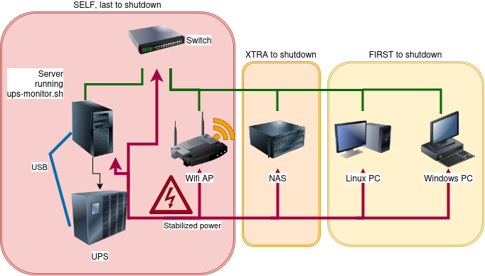

# ups-monitor.sh

A robust Linux Bash script designed for **NUT (Network UPS Tools)** to manage staged shutdowns during power outages. It is specifically optimized for Eaton UPS units (supporting `TRIM/AVR` status) but works with any UPS supported by NUT. It is aimed at a home hobbyist network with more than one machine on the same UPS that can be shut down via ssh from the linux server connected to the UPS via USB.

Only tested on Debian and Ubuntu with an USB-connected Eaton 5SC UPS.



## Features

- **Staged Shutdown Logic**:
  
  - **90% Battery**: Shuts down non-critical "First" servers (e.g., storage, backups).
  
  - **80% Battery**: Shuts down "Extra" servers.
  
  - **20% Battery**: Shuts down the monitoring host and places the UPS in standby to conserve battery while ensuring it automatically wakes up when power returns.

- **Configuration File**: Change these (and more) in the optional `/etc/ups-monitor.conf` to override settings without modifying the main script.

- **AVR Tracking**: Special handling for `TRIM` (overvoltage) and `BOOST` (undervoltage) events, logging the exact input voltage during these fluctuations.

- **Email Alerts**: Sends notifications for power loss, staged shutdowns, and power restoration. Logs everything in `/var/log/ups-monitor/`

- **Dry-Run Mode**: If `/tmp/NOUPSMON` exists, the script logs actions but does not actually send shutdown commands or kill power.

- **Log Management**: Automatically rotates logs monthly and includes a `clean` command to prune old history.

My UPS provides power to some servers/NAS and main switch and wifi access point. This script allows to shutdown early the non-essential devices, and keep the main server live and wifi access to it (by ssh apps on phones and tablets) as long as possible.

## Prerequisites

- **A linux server**. The installation steps describe how to run the script via `systemd`, but you can choose to just run it via any means you want.

- **The Network UPS Tools (NUT)** package (`upsc` and `upscmd` utilities installed).

- **Mail** configured for outgoing alerts.

- **SSH Key Access**: The monitoring host must have passwordless SSH access from the local root account under which the script runs to the remote servers it needs to shut down.

- **Security caveat**: Not suitable for high-security environments. This script requires root execution, stores the UPS password in plain text, and relies on passwordless SSH keys to manage remote servers. It is ideal for protected home networks but should be avoided in enterprise settings where "bad actor" access is a concern.

- **Hardware**: Of course, an **UPS power supply unit**, connected to the server via usb. I chose an Eaton 5SC 100i, but it should work with most brands and models.

**Warning**: I advise strongly to chose a "**pure sine wave**" UPS. Otherwise, when switching to batteries, your computer power supply (the ones with "Active PFC") may not like the "squarish" wave shape of the voltage coming out of the UPS, and decide to shut down abruptly in panic. E.g, do not buy the "Ellipse" line of Eaton UPS. The Eaton 5SC was the cheapest nice "pure sine wave" gear I could find around me, but many others fit the bill. Granted, in real life, power supplies will very rarely experience this problem, but buying a "pure sine wave" UPS eliminates the uncertainty, but is more expensive than a simulated sine wave UPS. Your choice.

**Tip**: do not hesitate to chat with your favorite AI to help you on these subjects if you feel lost. Chatting with Gemini was very helpful for me, a UPS-novice, in coding this script, by asking for context, vocabulary, explanations, debug, testing, and toying with "what if" scenarios, even if it did not actually write the code or the doc of this script.

## Installation

1. install nut
   ```bash
   sudo apt install nut
   ```
2. copy the script into your path, e.g. `/usr/local/bin`
   ```bash
   cp ups-monitor.sh /usr/local/bin/ups-monitor.sh
   ```
3. Setup Systemd Service:
   Create `/etc/systemd/system/ups-logic.service` containing:
   ```ini
   [Unit]
   Description=UPS Monitoring and Staged Shutdown Logic
   After=nut-server.service
   
   [Service]
   ExecStart=/usr/local/bin/ups-monitor.sh
   Restart=always
   User=root
   
   [Install]
   WantedBy=multi-user.target
   ```
4. Setup your local **configuration**:
   create and edit `/etc/ups-monitor.conf` to customize your setup. You can use the provided `doc/ups-monitor-sample.conf` as a guide, and also see the Configuration section below.
5. Enable and start:
   ```bash
   sudo systemctl enable --now ups-logic.service
   ```
6. Setup Daily Cleanup:
   Add this to your root crontab (`sudo crontab -e`) to delete logs in `/var/log/ups-monitor/` older than a year and keep a copy of the UPS complete state at the beginning of the day for reference:
   ```bash
   01 00 * * * /usr/local/bin/ups-monitor.sh clean
   ```
   
### Configuration
  
   `/etc/ups-monitor.conf` is a bash script that will be executed (sourced) by the script on startup, so you can there redefine any bash variable and functions definitions occuring in the script before the comment `END OF CONFIGURATION`

You can redefine the battery levels at which you trigger the shutdown of the first and xtra servers, and the names of these servers.

Note that you can also redefine the functions. For instance, you could redefine `remoteshut` to execute complex exotic actions, or redefine `info` to warn the admin other than by email: a phone message, a sound alarm, ...

After editing this file, always restart the daemon:
```
sudo systemctl restart ups-logic.service
```

#### Shutdown options

The configuration variables `SERVERS_FIRST` and `SERVERS_XTRA` are bash arrays containing a list of hosts. These can be prefixed by the account to log in if it is not root, and also be prefixed by h: to perform an hibernate action instead:
- `myserver` will shutdown the host named "myserver"
- `h:myserver` will first attempt to hibernate the linux server, but revert to a shutdown if the hibernation command fails

For windows hosts, prefix them by `wh:` to perform an hibernation (or a shutdown if hibernation fails), or `ws:` for a full poweroff shutdown. E.g:

```bash
SERVERS_FIRST=(store root2@backup h:steam wh:colas@games ws:anne@nas)
```
The windows machines must have the OpenSSH server installed, and configured to be able to connect to an administrator account without a password. See [Installing and Enabling OpenSSH on Windows](https://docs.ssw.splashtop.com/docs/installing-and-enabling-openssh-on-windows).

#### Other actions

You can extend the type of actions done by writing "pseudo servers" in the `SERVERS_FIRST` and `SERVERS_XTRA` in the form of `funcname:params`. Then instead of performing a shutdown via ssh, the script will thus just execute the bash function `funcname` — that you must define also in the config file — with the parameters `params`. You can pass multiple parameters by separating them with commas in the `params` string.

Example of contents of `/etc/ups-monitor.conf`:
```bash
SERVERS_FIRST=(nas backup-databases:dbuser,mbase,pbase)
backup-databases(){
    mysqldump -u "$1" -p "$2" > /var/tmpbackup_mysql.sql
    pg_dump -U "$1" "$3" > /var/tmp/backup_postgres.sql
}
```

#### Limitations

Currently, the script only performs actions at three battery levels: first, extra, and self. While it is possible to implement a customizable number of levels, I don't believe there is a practical use case for this feature. Adding it would significantly increase the script's complexity, making it more error-prone and difficult to maintain. However, I am open to considering it if a real-world need arises—please open an issue if you have one.

### Upgrade

If a new version is published, just:

```bash
# download and copy the new ups-monitor.sh
cp ups-monitor.sh /usr/local/bin/ups-monitor.sh
# restart the service
sudo systemctl restart ups-logic.service
```

And of course check the Release Notes at the end of this README to check if any manual action is required for the upgrade.

## Logging

The script maintains two types of logs in `/var/log/ups-monitor/`:

- `last.status`: A snapshot of the full UPS status output the last time an alert was triggered.
- `YYYY-MM.log`: A chronological history of every status change and action taken (the subjects of the sent emails).

Example of log:
```
2026-02-22 10:12:05 OL CHRG
2026-02-22 10:26:10 OL CHRG TRIM input: 238.0V
2026-02-22 10:29:01 OL CHRG
2026-02-22 11:12:19 OL CHRG TRIM input: 240.2V
2026-02-22 13:22:27 OL CHRG
2026-02-22 13:33:38 OB DISCHRG
2026-02-22 13:33:38 Power lost, battery 100%
2026-02-22 13:34:18 OL DISCHRG
2026-02-22 13:34:23 OL CHRG
```

Example of email sent for the 2026-02-22 13:33:38 entry above: (the other ones in the log excerpt do not generate an email)
```
To: root@myserver.mydomain.org
Subject: Eaton 5SC UPS on myserver: Power lost, battery 100%
Date: Sun, 22 Feb 2026 13:33:38 +0100 (CET)
From: root <root@myserver.mydomain.org>

Power Lost! Status: OB DISCHRG, Battery: 100%
```

## Testing

To test your logic without actually shutting down your infrastructure, with the service running:

1. Run `touch /tmp/NOUPSMON`. Creating this file will dynamically switch the script in "dry run" mode without the need to restart it.
2. Unplug your UPS.
3. Monitor the logs: `tail -f /var/log/ups-monitor/$(date +%Y-%m).log`.
4. Once satisfied, `rm /tmp/NOUPSMON`. No need to restart the service.

## License

MIT License - (c) 2026 Colas Nahaboo.
In a nutshell: do whatever you want with this, and please credit me, but expect no warranty.

## Release Notes
- v1.3.1 2026-02-26 email (once) when UPS is overloaded, and overload values logged
- v1.3.0 2026-02-25 h: prefix allows to hibernate linux hosts
  Status changes between OL CHRG OVER and OL CHRG are not logged anymore
  Log a specific entry when starting, with the version number
- v1.2.1 2026-02-22 Bug fix: no mail was sent when power was back after a cut
- v1.2.0 2026-02-22 Totally customizable actions via funcname:params pseudo hosts
- v1.1.1 2026-02-22 Typo fixed for windows hosts
- v1.1.0 2026-02-22 Built-in way to shutdown or hibernate Windows hosts
- v1.0.0 2026-02-22 First public release
